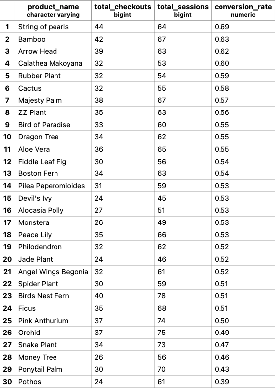

**WEEK 03 HOMEWORK**

**(Part 1) Create New Models to Answer Business Questions**

1. What is our overall conversion rate? **0.62**

```
-- calculate overall metrics
select
      round(sum(checkout::numeric) / 
          count(session_guid),2)         as conversion_rate
    , round(avg(total_page_views),1)     as avg_page_views
    , min(session_min)                   as min_session_duration          
    , round(avg(session_min),1)          as avg_session_mins
    , max(session_min)                   as max_session_duration
from dbt_jason_d.fct_user_sessions
```

2. What is our conversion rate by product? **between 0.39 and 0.69**

```
-- calculate metrics by product
with metrics as (

select
    product_guid
    , product_name
    , count(distinct session_guid) as total_sessions
    , sum(checkout) as total_checkouts
    , sum(checkout::numeric) / 
          count(distinct session_guid) as prod_conv_rate

from dbt_jason_d.fct_user_session_product_events
group by 1,2

)

-- tidy up table w/some quick rounding + sort by top converting product
select
    product_name
    , total_checkouts
    , total_sessions
    , round(prod_conv_rate,2) as conversion_rate
from metrics
order by conversion_rate desc
```




**Why might certain products be converting at higher/lower rates than others?**
        - Note: we don't actually have data to properly dig into this, but we can make some hypotheses. 

Products with HIGHER Conversion Rates:
- market trends (popular plants, influencer recomendations)
- price points and/or photo/staging on website
- great reviews by other users
- discounts/promotions/email-marketing

Products with LOWER Conversion Rates:
- poor reviews by other users 
- poor placing on site
- product no longer popular (should be dropped)
- poor photo/staging of products


**(Part 2) Applying Macro to Improve dbt Project**

create_event_type_flags()
- i did not apply the aggreation here b/c i wanted to keep the data at the event-level in the intermediate table.
- that way i could clean/prep data and handle the aggregation for the product-level which posed issues due to checkout/package_shipped having nulls under order_guid/product_guid (anyway, you know what i mean...lol)

```

        

        
        , case when event_type = '{{event_type}}' then 1 else 0 end as {{event_type}}
        

```