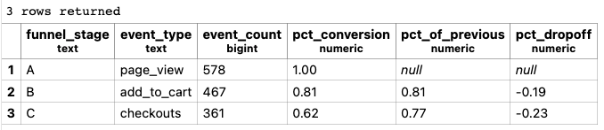
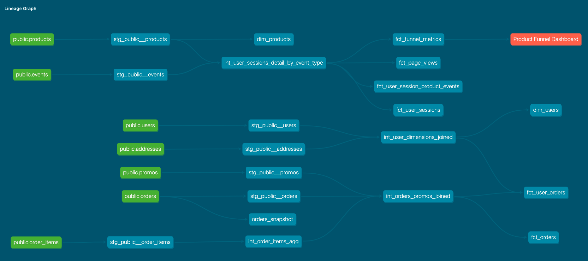

**WEEK 03 HOMEWORK**

**(Part 1) dbt Snapshots**

```


{{
    config(
      target_database = 'dbt',
      target_schema   = 'snapshots',
      unique_key      = 'order_id',

      strategy        = 'check',
      check_cols      = ['status'],
    )
}}

select * from {{ source('public', 'orders') }}


```

**(Part 2) Modeling Challenge**



**How are our users moving through the product funnel?**
  - as we've seen, overall conversion is very high for greenery. 
  - this analysis is focused on sessions so a deeper dive into user behavior would be useful for this question

**Which steps in the funnel have largest drop off points?**
  - Out of 578 total sessions we saw 81% of them move to the next stage of the funnel (page-view to add-to-cart). That -19% dropoff is significant but not as significant as the dropoff from sessions having an add-to-cart event BUT not moving on to checkout; this dropoff was -23% and something for the company to take a close look at.

  **query to answer the question and make the table above:**

My query is obviously extra long. If more time I'd work on my data-models for events and refactor to make things more user-friendly. This worked but wasn't exactly what i'd want to do every time. Seems that i need a table that has the wide table (w/event flags) and one that has the long table (by event type, more tidy version) so that the user can group by the event type to get a view like the one in the table above. I basically had to 'unpivot' the table to get there

```
with user_sessions as (

    -- prep data at session/user level
    select
    session_guid
    , user_guid
    , max(page_view) as page_view
    , max(add_to_cart) as add_to_cart
    , max(checkout)    as checkout
    from dbt_jason_d.fct_user_session_product_events
    group by 1,2

),

page_views as (

    select
        'A' as funnel_stage
        , 'page_view' as event_type
        --, count(distinct user_guid) as unique_users
        , sum(page_view) as event_count
    from user_sessions
    group by 1

),

add_to_carts as (

    select
        'B' as funnel_stage
        , 'add_to_cart' as event_type
        --, count(distinct user_guid) as unique_users
        , sum(add_to_cart) as event_count
    from user_sessions
    group by 1

),

checkout as (

    select
        'C' as funnel_stage
        , 'checkouts' as event_type
        --, count(distinct user_guid) as unique_users
        , sum(checkout) as event_count
    from user_sessions
    group by 1

),

stacked_metrics as (

    select * from page_views
    union
    select * from add_to_carts
    union
    select * from checkout
    order by funnel_stage

)

-- calculate metrics
select
    stacked_metrics.*
    , round( event_count::numeric / 
           ( max(event_count) over() ), 2) as pct_conversion
    , round(event_count::numeric / 
           ( lag(event_count) over(order by funnel_stage) ), 2) as pct_of_previous
    , round( (event_count - lag(event_count) over (order by funnel_stage) )::numeric /
            ( lag(event_count) over (order by funnel_stage) ), 2) as pct_dropoff
from stacked_metrics
```


**Final Lineage Graph (Dag)**


